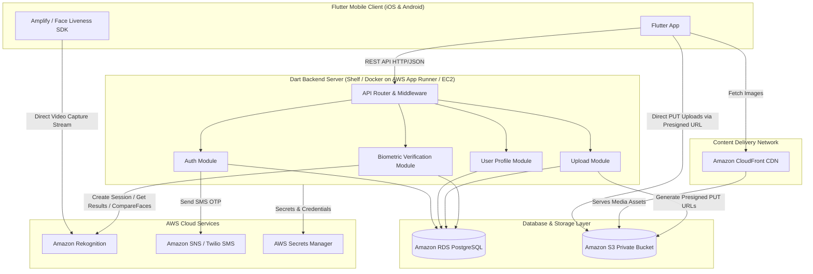

# DEN Backend, Database Schema & AWS Services Specification

This document serves as the complete technical blueprint for the **DEN Dart Backend**, **PostgreSQL Database Schema**, and **AWS Infrastructure Integration**.

---

## 1. System Architecture Overview

The DEN backend is designed around a **server-authoritative security model**. The Flutter mobile client never directly holds long-lived AWS IAM keys, nor does it write directly to database tables. All sensitive logic, S3 URL signing, and biometric verification workflows are orchestrated server-side.



---

## 2. PostgreSQL Database Schema Specification

All database tables follow strict security & privacy constraints:
- **Least-Privilege Defaults**: Roles default to `'user'`, verification flags default to `FALSE`.
- **Hashed Credentials**: OTPs and session tokens are stored exclusively as SHA-256 hashes.
- **Biometric Ephemerality**: Biometric video captures are **never** stored in the database.
- **Financial Precision**: All monetary values are stored as `NUMERIC(12, 2)` (never floating point).
- **Timezone Awareness**: All timestamps use `TIMESTAMPTZ` (UTC).

### SQL DDL Schema Migration Script

```sql
-- Enable UUID extension for secure, unguessable primary keys
CREATE EXTENSION IF NOT EXISTS "uuid-ossp";

-- -----------------------------------------------------------------------------
-- 1. USERS TABLE
-- Stores core user identity, onboarding state, and profile metadata.
-- -----------------------------------------------------------------------------
CREATE TABLE users (
    id UUID PRIMARY KEY DEFAULT uuid_generate_v4(),
    phone_number VARCHAR(20) UNIQUE NOT NULL,
    full_name VARCHAR(120),
    dob DATE,
    gender VARCHAR(30),
    height_cm INTEGER CHECK (height_cm IS NULL OR (height_cm >= 120 AND height_cm <= 230)),
    location VARCHAR(120),
    instagram_username VARCHAR(30),
    status VARCHAR(30) NOT NULL DEFAULT 'pending_onboarding' 
        CHECK (status IN ('pending_onboarding', 'active', 'suspended', 'deactivated')),
    is_verified BOOLEAN NOT NULL DEFAULT FALSE,
    role VARCHAR(30) NOT NULL DEFAULT 'user' 
        CHECK (role IN ('user', 'host', 'admin')),
    created_at TIMESTAMPTZ NOT NULL DEFAULT CURRENT_TIMESTAMP,
    updated_at TIMESTAMPTZ NOT NULL DEFAULT CURRENT_TIMESTAMP
);

CREATE INDEX idx_users_phone ON users(phone_number);
CREATE INDEX idx_users_status ON users(status);

-- -----------------------------------------------------------------------------
-- 2. USER_PHOTOS TABLE
-- Manages S3 photo keys, ordering, and primary photo designations.
-- -----------------------------------------------------------------------------
CREATE TABLE user_photos (
    id UUID PRIMARY KEY DEFAULT uuid_generate_v4(),
    user_id UUID NOT NULL REFERENCES users(id) ON DELETE CASCADE,
    object_key VARCHAR(512) NOT NULL,
    public_url VARCHAR(1024) NOT NULL,
    position INTEGER NOT NULL DEFAULT 0,
    is_primary BOOLEAN NOT NULL DEFAULT FALSE,
    created_at TIMESTAMPTZ NOT NULL DEFAULT CURRENT_TIMESTAMP
);

CREATE INDEX idx_user_photos_user_id ON user_photos(user_id);
CREATE UNIQUE INDEX idx_one_primary_photo_per_user ON user_photos(user_id) WHERE is_primary = true;

-- -----------------------------------------------------------------------------
-- 3. AUTH_OTPS TABLE
-- Tracks short-lived 6-digit OTP verification challenges for SMS login.
-- -----------------------------------------------------------------------------
CREATE TABLE auth_otps (
    id UUID PRIMARY KEY DEFAULT uuid_generate_v4(),
    phone_number VARCHAR(20) NOT NULL,
    otp_hash VARCHAR(64) NOT NULL, -- SHA-256 hash of 6-digit OTP
    attempts INTEGER NOT NULL DEFAULT 0,
    expires_at TIMESTAMPTZ NOT NULL,
    verified_at TIMESTAMPTZ,
    created_at TIMESTAMPTZ NOT NULL DEFAULT CURRENT_TIMESTAMP
);

CREATE INDEX idx_auth_otps_phone ON auth_otps(phone_number, expires_at);

-- -----------------------------------------------------------------------------
-- 4. USER_SESSIONS TABLE
-- Stores authenticated sessions using hashed session tokens.
-- -----------------------------------------------------------------------------
CREATE TABLE user_sessions (
    id UUID PRIMARY KEY DEFAULT uuid_generate_v4(),
    user_id UUID NOT NULL REFERENCES users(id) ON DELETE CASCADE,
    session_token_hash VARCHAR(64) UNIQUE NOT NULL, -- SHA-256 hash of session token
    expires_at TIMESTAMPTZ NOT NULL,
    created_at TIMESTAMPTZ NOT NULL DEFAULT CURRENT_TIMESTAMP,
    last_active_at TIMESTAMPTZ NOT NULL DEFAULT CURRENT_TIMESTAMP
);

CREATE INDEX idx_user_sessions_hash ON user_sessions(session_token_hash);
CREATE INDEX idx_user_sessions_user_id ON user_sessions(user_id);

-- -----------------------------------------------------------------------------
-- 5. FACE_LIVENESS_SESSIONS TABLE
-- Audits biometric verification sessions with AWS Rekognition.
-- -----------------------------------------------------------------------------
CREATE TABLE face_liveness_sessions (
    id UUID PRIMARY KEY DEFAULT uuid_generate_v4(),
    user_id UUID NOT NULL REFERENCES users(id) ON DELETE CASCADE,
    aws_session_id VARCHAR(128) UNIQUE NOT NULL,
    status VARCHAR(30) NOT NULL DEFAULT 'created' 
        CHECK (status IN ('created', 'passed', 'failed', 'expired')),
    confidence_score NUMERIC(5,2),
    similarity_score NUMERIC(5,2),
    created_at TIMESTAMPTZ NOT NULL DEFAULT CURRENT_TIMESTAMP,
    completed_at TIMESTAMPTZ
);

CREATE INDEX idx_liveness_user_id ON face_liveness_sessions(user_id);
CREATE INDEX idx_liveness_aws_session ON face_liveness_sessions(aws_session_id);

-- -----------------------------------------------------------------------------
-- 6. USER_AUDIT_LOGS TABLE
-- Security audit trail for key identity & state transitions (no PII logged).
-- -----------------------------------------------------------------------------
CREATE TABLE user_audit_logs (
    id UUID PRIMARY KEY DEFAULT uuid_generate_v4(),
    user_id UUID REFERENCES users(id) ON DELETE SET NULL,
    action VARCHAR(64) NOT NULL, -- e.g., 'OTP_SENT', 'OTP_VERIFIED', 'FACE_VERIFIED'
    ip_address VARCHAR(45),
    user_agent VARCHAR(256),
    created_at TIMESTAMPTZ NOT NULL DEFAULT CURRENT_TIMESTAMP
);

CREATE INDEX idx_audit_logs_user_id ON user_audit_logs(user_id);
```

---

## 3. AWS Infrastructure & Cloud Services Specification

### A. Amazon RDS (PostgreSQL)
- **Engine**: PostgreSQL 16+
- **Security**: Placed in private VPC subnets with strict Security Group ingress (only accessible by backend instances). Encryption enabled at rest via AWS KMS.

### B. Amazon S3 Bucket (`den-media-bucket`)
- **Bucket Policy**: Private bucket with restricted access. Public reads routed exclusively via Amazon CloudFront CDN.
- **Presigned Upload Scoping**:
  - Expiration: **300 seconds (5 minutes)**.
  - Path Scoping: `users/{user_id}/photos/{uuid}.jpg`
- **CORS Configuration**:
```json
[
  {
    "AllowedHeaders": ["*"],
    "AllowedMethods": ["PUT"],
    "AllowedOrigins": ["*"],
    "ExposeHeaders": ["ETag"]
  }
]
```

### C. Amazon Rekognition
- **Services Used**:
  1. `CreateFaceLivenessSession` — Initializes liveness capture session for client SDK.
  2. `GetFaceLivenessSessionResults` — Retrieves confidence score ($> 90\%$) & reference face frame.
  3. `CompareFaces` — Matches reference face frame against `user_photos[is_primary=true]` ($> 85\%$ threshold).
- **Abuse Prevention Rate Limit**: Maximum **3 face-liveness verification attempts per user per 24 hours**, enforced server-side before invoking `CreateFaceLivenessSession`.
- **IAM Policy**: Server backend service role given `rekognition:CreateFaceLivenessSession`, `rekognition:GetFaceLivenessSessionResults`, and `rekognition:CompareFaces`.

### D. Amazon SNS / Twilio SMS
- **SMS Gateway**: Amazon SNS or Twilio Messaging API for sending 6-digit OTPs.
- **Rate Limits**: Maximum 3 OTP send requests per phone number per hour.

### E. Amazon CloudFront CDN
- **Distribution Domain**: `https://cdn.denapp.com` (or AWS default `.cloudfront.net`).
- **Origin**: S3 bucket `den-media-bucket.s3.ap-south-1.amazonaws.com`.
- **Caching**: 24-hour default TTL for user images.

---

## 4. Backend Functions & Service Modules (Dart Backend)

The Dart backend is structured cleanly into service modules handling specific domain logic:

```
backend/
├── bin/
│   └── server.dart                   # Entry point (Shelf server initialization)
├── lib/
│   ├── config/
│   │   ├── env.dart                  # Environment configuration & AWS credentials setup
│   │   └── database.dart             # PostgreSQL connection pool (package:postgres)
│   ├── middleware/
│   │   ├── auth_middleware.dart       # Session token validation & user context injection
│   │   ├── rate_limit_middleware.dart  # IP and Phone number rate limiting
│   │   └── security_headers.dart     # CORS & Security headers
│   ├── modules/
│   │   ├── auth/
│   │   │   ├── auth_controller.dart  # Route handlers for OTP send & verify
│   │   │   └── auth_service.dart     # OTP generation, hashing, SMS dispatch, session creation
│   │   ├── user/
│   │   │   ├── user_controller.dart  # Onboarding & profile handlers
│   │   │   └── user_service.dart     # Profile persistence & query logic
│   │   ├── upload/
│   │   │   ├── upload_controller.dart # S3 presigned URL handler
│   │   │   └── upload_service.dart    # AWS S3 SDK presigned URL generator
│   │   └── biometric/
│   │       ├── biometric_controller.dart # Liveness session & verify handlers
│   │       └── biometric_service.dart    # AWS Rekognition SDK wrapper (Liveness + CompareFaces)
│   └── shared/
│       ├── security_utils.dart       # SHA-256 hashing, crypto token generation
│       └── validators.dart           # Input schemas (Zod equivalent in Dart)
```

---

## 5. API Endpoints, Server Functions & AWS Mapping Matrix

| API Endpoint | HTTP Method | Auth Required | Dart Backend Function | DB Operations | AWS / External Services Invoked |
| :--- | :--- | :--- | :--- | :--- | :--- |
| `/api/auth/send-otp` | `POST` | Public | `AuthController.sendOtp()` | `INSERT INTO auth_otps` (hashed OTP) | **Amazon SNS / Twilio** (Dispatch SMS) |
| `/api/auth/verify-otp` | `POST` | Public | `AuthController.verifyOtp()` | `SELECT auth_otps`, `INSERT INTO users`, `INSERT INTO user_sessions` | None |
| `/api/uploads/photo-url` | `POST` | Session Auth | `UploadController.getPresignedUrl()` | `SELECT user_sessions` | **AWS S3** (`S3.getSignedUrlPromise('putObject')`) |
| `/api/onboarding/face-liveness/session` | `POST` | Session Auth | `BiometricController.createLivenessSession()` | `INSERT INTO face_liveness_sessions` | **AWS Rekognition** (`CreateFaceLivenessSession`) |
| `/api/onboarding/verify-face` | `POST` | Session Auth | `BiometricController.verifyFace()` | `UPDATE face_liveness_sessions`, `UPDATE users SET is_verified = TRUE` | **AWS Rekognition** (`GetFaceLivenessSessionResults` + `CompareFaces`) |
| `/api/users/onboarding` | `POST` | Session Auth | `UserController.completeOnboarding()` | `UPDATE users`, `INSERT INTO user_photos` | None |
| `/api/users/me` | `GET` | Session Auth | `UserController.getProfile()` | `SELECT users JOIN user_photos` | None |

---

## 6. Security, Privacy & Biometric Compliance Checklist

- [x] **No Untrusted Input Concatenation**: All database queries use parameterized placeholders (`$1`, `$2`).
- [x] **Hashed Tokens & OTPs**: Session tokens and OTP codes are hashed via `SHA-256` before writing to PostgreSQL.
- [x] **Biometric Ephemerality**: Face liveness captures are processed transiently in AWS Rekognition RAM. No video frames or biometric vectors are saved to S3 or PostgreSQL.
- [x] **Least-Privilege Authorization**: DB default values ensure `is_verified = FALSE` and `role = 'user'`.
- [x] **Client AWS Decoupling**: Mobile app calls ONLY backend API endpoints; no IAM keys or long-lived AWS tokens are delivered to the mobile client.
- [x] **Short-Lived Upload URLs**: S3 presigned PUT URLs expire strictly after 5 minutes (300s).
- [x] **Rekognition Abuse Prevention**: Strict rate limit of max 3 face-liveness verification attempts per user per 24 hours enforced server-side prior to calling `CreateFaceLivenessSession`.
